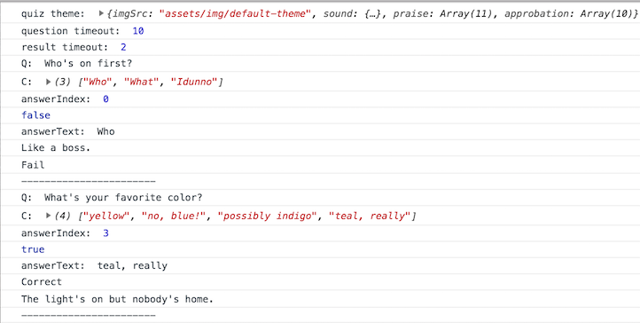
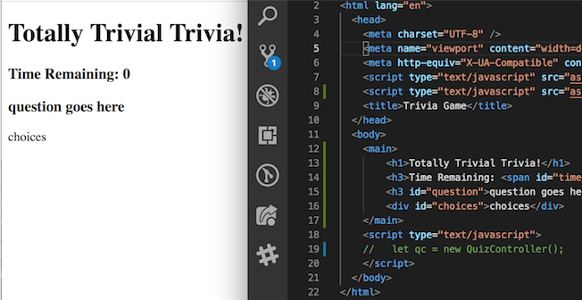
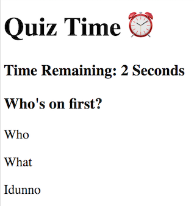
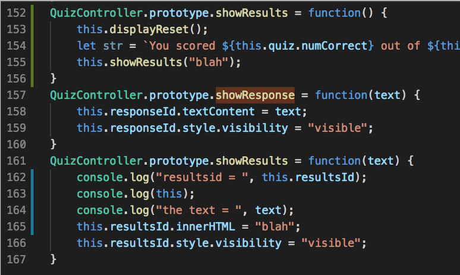
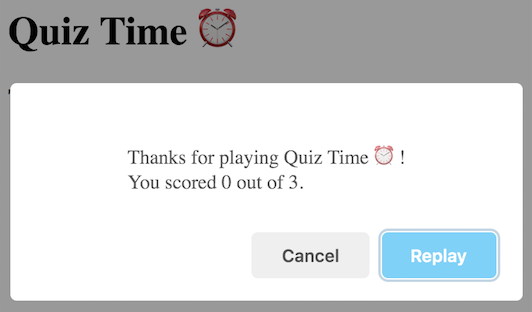
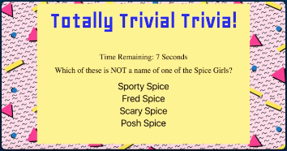
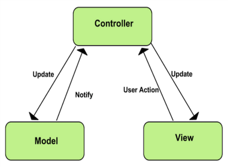

# utbc2019-hw-05-quiz-engine

This week I'm working on an interval timer-based quiz game I'm calling Quiz Time ⏰.

Users answer a series of multiple choice questions in the presence of a count-down timer.  Results are presented at the end with the option to replay the quiz.

# Implementation Details

I knocked out the guts of the quiz [json](https://github.com/zenglenn42/utbc2019-hw-05-quiz-engine/blob/7d374a4b17eee2ca725413aefdeb9055ce41fc12/assets/js/model.js#L1), [model](https://github.com/zenglenn42/utbc2019-hw-05-quiz-engine/blob/7d374a4b17eee2ca725413aefdeb9055ce41fc12/assets/js/model.js#L74) and [controller](https://github.com/zenglenn42/utbc2019-hw-05-quiz-engine/blob/7d374a4b17eee2ca725413aefdeb9055ce41fc12/assets/js/controller.js#L1) in a day.  The models come pretty easily for me and are a natural starting point.  I don't need any other pieces to get it going other than some wafer thin html and a console log:

(How I'm feeling about the model and controller in this project.)

The controller was another story.  It felt more like a street fight and had a ton of callbacks to manage both input clicks and various interval timers.  First I stood up a primitive user interface:

and worked to get the controller to pull in quiz questions from the json in the model.  I also add clickability to the response text.  Once I got that going I started layering in the timer intervals.  I dropped out of flow state a couple times and felt like I was atop some high-rise contruction project.  I restarted by just focusing on the interval that brings up a new quiz item every 10 seconds, iterating over a short quiz of 3 questions for starters.  Then I added the 1-second interval timer that drives the countdown timer.  The count itself resides in the quiz model, but I provide methods to mutate it.  Several times, I forgot to actually /invoke/ the closure that returns the callback reference as an argument to setInterval, killing the expected periodic behavior.  I also got tripped up by the whole msec versus secs thing and would introduce what I thought was a 1 second timeout, only to have it fire in 1 msec with stuff happening in rapid succession.  It was a beautiful thing to finally see questions advancing and the countdown timer at the top of the page decrementing:

For the longest time, I was unable to get the silly results to display until I realized I somehow had /two/ methods by the same name and I was mutating the one that wasn't firing!  I guess this is the price I pay for javascript's permissive and relaxed feel versus the more hawkish forrays I've had with compiled languages like C++:

The time invested with sweetalerts in a previous project allowed me to leverage the promise-based syntax nicely with action blocking in the replay scenario (sans the annoying behavior of native alerts that often render before some other prior DOM updates have rendered).

# Designer's Log

## Blue Sky

As with my [Word Stop](https://github.com/zenglenn42/utbc2019-hw-03-wordgame/blob/fb11d26422f2a119c03826527539e3fdb5661f91/assets/js/lexicon.js#L36) game, I see all sorts of potential for a data-driven design, supporting various quizzes with unique visual and audio themes.  

Given that I'm learning about ajax and api endpoints, I wonder if there are json or xml standards already out there for this kind of data?  Perhaps my little quiz engine could be designed to tap into a wealth of content already out there.

([Image](https://flic.kr/p/24B2fo9) courtesy Gary Campbell-Hall, CC BY 2.0)

The other blue sky thought is how fun it would be to introduce some of the cool learning models out there that look at memory attenuation and how mastery and learning efficiency can be improved by repeating a question just at the point we have to struggle a little bit to recall it.

I've played with some of these so called 'spaced repetition systems' but have always felt disappointment at the lack of curation for the quiz decks that drive them and that get thrown up on the web.  There's no way to gauage the quality of 3rd party content, to easily flag errors, to see a history of changes over time, to contribute suggestions such that the content becomes better and more authoratative over time.

Coming up with a good deck of cards is very time consuming and really good decks should rise above the others and be evangelized and possibly opened sourced for community maintenance.  Fortunately a well understood model exists for this ... up-and-down voting, likes, and stars on social media.

💡 So before I come back down to earth and knock this assignment out, I'm thinking a very cool project would be a mashup of an SRS engine with github-backed curation. I know github's api provides all sorts of discovery features, so basic consumers of the quiz data could have a nice frontend that distills things down to star-ranked content.  Make it easy for a user to open feature requests or report bugs or problems with content through a streamlined frontend.  I've even seen chat integration in Visual Studio Code that leverages github authentication, so there's all sorts of potential for social integration.

## Terra Firma

I'm happy with the basic frontend design offered up in the problem spec, though I'll probably restyle it a bit:

Stacking the choices vertically maximizes horizontal screen usage and opens up our choices for longer text.  It also works nicely equally well on desktop and mobile.

For the backend data design, I'll go with a relatively simple structure, though I'll probably use some objects to allow for future support of responses that include images and other attributes besides just straight text.  I'll probably wedge in /some/ basic thematic meta data along with the quiz questions, now that I've been through this routine with [Word Stop](https://github.com/zenglenn42/utbc2019-hw-03-wordgame/blob/fb11d26422f2a119c03826527539e3fdb5661f91/assets/js/lexicon.js#L36).

I'm really liking promised-based [sweetalerts](https://sweetalert.js.org/), so they will likely make an appearance in my user interface.  They also support timeout behavior that would be natural to leverage when reporting the correct answer before automatically proceeding to the next question.

The whole MVC decomposition is becoming very natural for me.  I enjoy working on the model, then controller, then view.  Standing up a controller usually requires adding a very clunky and skeletal user interface at first, but it's cool to go back and transform that bit of dry html into something pleasing with CSS. 🦋

([Image](https://developer.chrome.com/apps/app_frameworks) courtesy Google, CC BY 3.0)

This is kinda how I'm currently thinking about MVC.  I have seen diagrams where the model directly notifies the /view/, but my models really no nothing about the view from a behavior perspective.  Perhaps that will change once I get into more sohpisticated frameworks that perform data binding between model and view.  Most of the model interaction amounts to controller calls or controller instantiation of a model object.  The controller is also in the eye of the storm, responding to user input events.

